# Entity-relationship audit, 2026-10-08

Scope: all 149 Eloquent models (`app/Models/**`) checked against the real schema: the local MySQL 8 replica of
production (303 tables, 56 DB-level foreign keys, all InnoDB locally; production still has MyISAM tables).
Method: every public relation was instantiated by reflection and its foreign, owner and pivot keys compared with
`information_schema` (existence, type family, index); orphan rows were counted with `NOT EXISTS`; polymorphic
`*_type` values were read from the data. Only counts are recorded here, never row content.
Guard: `tests/Feature/Audit/EntityRelationshipTest.php` repeats the relation check on every run.

`User` is still the model name (the rename to Employee is scheduled last). Its primary key is `users.employee_id`,
a **string** (numeric-looking such as `120`, `1231`, but also `LOCAL-QA-ADMIN`); `$user->id` is an accessor alias.

## Core-domain ER diagram

Edges are the real foreign-key columns used by the models (all point at `users.employee_id` unless shown).
Approvals have no table of their own: `leaves`, `overtime_requests`, `attendance_regularizations` and
`shift_swap_requests` carry the approver chain in `approval_chain` (JSON) and `approved_by`; routing is decided by
`App\Services\Approvals\ApprovalRouting` from `users.report_to` and `departments.manager_id`.

```mermaid
erDiagram
    users {
        string employee_id PK
        string report_to FK "self, line manager"
        bigint department_id FK
        bigint designation_id FK
        bigint work_location_id FK
        bigint attendance_type_id FK
        date probation_end_date
    }
    departments { bigint id PK
        bigint parent_id FK "self"
        string manager_id FK "head, users" }
    designations { bigint id PK
        bigint department_id FK
        bigint parent_id FK "self" }
    user_department_scopes { bigint id PK
        string user_id FK
        bigint department_id FK
        string granted_by FK }
    users }o--|| departments : department_id
    users }o--|| designations : designation_id
    users |o--o{ users : report_to
    departments |o--o| users : manager_id
    departments ||--o{ designations : department_id
    users ||--o{ user_department_scopes : user_id
    departments ||--o{ user_department_scopes : department_id

    attendances { bigint id PK
        string user_id FK
        date date
        datetime punchin }
    attendance_regularizations { bigint id PK
        string user_id FK
        bigint attendance_id FK
        string approved_by FK }
    overtime_requests { bigint id PK
        string user_id FK
        string approved_by FK }
    users ||--o{ attendances : user_id
    attendances ||--o{ attendance_regularizations : attendance_id
    users ||--o{ attendance_regularizations : user_id
    users ||--o{ overtime_requests : user_id

    leave_settings { bigint id PK }
    leaves { bigint id PK
        string user_id FK
        bigint leave_type FK "leave_settings.id"
        json approval_chain }
    leave_ledger { bigint id PK
        string user_id FK
        bigint leave_type FK
        string actor_id FK }
    users ||--o{ leaves : user_id
    leave_settings ||--o{ leaves : leave_type
    leave_settings ||--o{ leave_ledger : leave_type
    users ||--o{ leave_ledger : user_id

    shifts { bigint id PK
        bigint department_id FK }
    shift_assignments { bigint id PK
        bigint shift_id FK
        string scope_id "polymorphic: user, department or designation id" }
    roster_days { bigint id PK
        string user_id FK
        bigint shift_id FK
        bigint swap_request_id FK
        bigint assignment_id "no relation" }
    shift_swap_requests { bigint id PK
        string requester_id FK
        string counterparty_id FK }
    departments |o--o{ shifts : department_id
    shifts ||--o{ shift_assignments : shift_id
    shifts |o--o{ roster_days : shift_id
    users ||--o{ roster_days : user_id
    shift_swap_requests |o--o{ roster_days : swap_request_id
    users ||--o{ shift_swap_requests : requester_id

    assets { bigint id PK
        string assignee_id FK }
    onboardings { bigint id PK
        string employee_id FK }
    onboarding_tasks { bigint id PK
        bigint onboarding_id FK
        string assigned_to FK }
    offboardings { bigint id PK
        string employee_id FK }
    offboarding_tasks { bigint id PK
        bigint offboarding_id FK }
    final_settlements { bigint id PK
        bigint offboarding_id FK
        string employee_id FK }
    absence_cases { bigint id PK
        string user_id FK
        bigint offboarding_id FK }
    users |o--o{ assets : assignee_id
    users ||--o{ onboardings : employee_id
    onboardings ||--o{ onboarding_tasks : onboarding_id
    users ||--o{ offboardings : employee_id
    offboardings ||--o{ offboarding_tasks : offboarding_id
    offboardings ||--o{ final_settlements : offboarding_id
    offboardings |o--o{ absence_cases : offboarding_id
    users ||--o{ absence_cases : user_id

    daily_works { bigint id PK
        string incharge FK
        string assigned FK
        string status }
    quality_ncrs { bigint id PK
        string reported_by FK
        string assigned_to FK
        bigint department_id FK
        bigint inspection_id FK "added by this audit" }
    quality_inspections { bigint id PK
        string inspector_id FK }
    users ||--o{ daily_works : incharge
    users ||--o{ daily_works : assigned
    users ||--o{ quality_ncrs : reported_by
    departments |o--o{ quality_ncrs : department_id
    quality_inspections |o--o{ quality_ncrs : inspection_id

    om_incidents { bigint id PK
        string reported_by FK
        string status }
    om_defects { bigint id PK
        string reported_by FK }
    om_work_orders { bigint id PK
        bigint defect_id FK
        string assigned_to FK
        string approved_by FK }
    users |o--o{ om_incidents : reported_by
    users |o--o{ om_defects : reported_by
    om_defects |o--o{ om_work_orders : defect_id
    users |o--o{ om_work_orders : assigned_by
```

## Findings

Severity: **Critical** = a live relation or table is wrong at runtime, or identity data is unrecoverable.
**High** = latent failure the moment a value, flag or rename arrives. **Medium** = integrity or performance risk.
**Low** = convenience. Status: FIXED (code or migration, with a test) / OPEN (owner decision) / NOTE.

| ID | Sev | Where | Finding | Status |
|---|---|---|---|---|
| E-01 | Critical | `app/Models/Aeon/Conversation.php:28` | `belongsTo(User::class)` derives the key `user_employee_id` (relation name + users' string PK); the column is `user_id`. Every `$conversation->user` returned null. | FIXED explicit key; test |
| E-02 | Critical | `app/Models/HRM/HrDocument.php:56` | `belongsToMany(User::class, 'employee_documents')` defaults the pivot key to `user_employee_id`; the table has `user_id`, `hr_document_id`. Attach and read fail. | FIXED explicit pivot and owner keys; test |
| E-03 | Critical | `app/Models/HRM/KPIValue.php:10,40`, `KPI.php:60` | Table derived as `k_p_i_values` (real: `kpi_values`); `kpi()` / `values()` keyed `k_p_i_id` (real: `kpi_id`). | FIXED `$table` + keys; test |
| E-04 | Critical | `app/Models/User.php:279` | `projects()` uses pivot `project_user`, which does not exist. Membership is `project_resources`, as `Project::resources()` already uses. | FIXED; test |
| E-05 | Critical | `app/Models/Project.php:89`, `app/Models/Jurisdiction.php:46` | `dailyWorks()` on `daily_works.project_id` / `jurisdiction_id`: neither column exists (jurisdiction is derived from chainage). No caller. | FIXED relations removed |
| E-06 | Critical | `app/Models/QualityNCR.php:89`, `QualityInspection.php:79` | `inspection_id` is fillable and related but `quality_ncrs` never had it (the 2024 migration put it on `quality_checkpoints`). | FIXED migration `2026_10_08_000002` adds nullable indexed column; test |
| E-07 | Critical | `activity_log.causer_id` (bigint) | 387 of 387 audit rows carry the legacy numeric `users.id` (value 18) that matches no employee; the column cannot store `LOCAL-QA-ADMIN`-style ids. "Who did it" was lost for all of them. | FIXED retype + remap to `151` via the legacy map (migration `..._000001`); test |
| E-08 | High | 35 columns across O&M, recruitment, DMS, safety, sessions (e.g. `OmSafetyIncident.php:56,61,66`, `OmInspection.php:60,65`, `OmToolboxTalk.php:39`, `OmEnvironmentalLog.php:42`, `OmLookup.php:34,39`, `OmSlaBreach.php:39`, `OmPreventiveSchedule.php:56`, `OmTppdClaim.php:54`, `OmInspectionTemplate.php:36`, `Job.php:69`, `JobApplicationStageHistory.php:47`, `LeaveAuditLog.php:22`) | Unsigned-integer columns referencing `users.employee_id` (varchar). A non-numeric id casts to 0 and never joins. Missed by `2026_09_02_000002` (added later, or table named `job_application_stage_history` not `..._histories`). Populated today: `activity_log`, `leave_audit_logs`, `leave_ledger`; the rest are empty. | FIXED converted to `varchar(50)` (MySQL; idempotent); migration lint test for new migrations |
| E-09 | High | `leave_audit_logs.actor_id`, `leave_ledger.actor_id` | 30 of 51 and 28 of 37 non-null actors unresolved (legacy ids 18, 26, 96). | FIXED remap, only where no employee owns the number |
| E-10 | High | `TrainingFeedback.php:12`, `TrainingAssignmentSubmission.php:15`, `TrainingEnrollment.php:12` | `SoftDeletes` on tables without `deleted_at`: every query errors. | FIXED column added (idempotent) |
| E-11 | High | `departments.manager_id` (read by `DepartmentScope.php:120` on every scoped request and by approval routing), `designations.parent_id`, `roster_days.assignment_id` (5,193 rows) and about 50 more relationship keys | Filtered or joined without an index. | FIXED 53 indexes, `hasIndex`-style guard, short keys only (MyISAM 1,000-byte key limit); test |
| E-12 | High | morph columns: `model_has_roles` (106), `model_has_permissions` (20), `notifications` (3,551), `personal_access_tokens` (3,185), `media` (1,353), `activity_log` (387) | Types are stored as the class name `App\Models\User` and no morph map exists. The scheduled User to Employee rename would orphan roles, permissions, notifications and API tokens. | OPEN: ship a data migration of the stored names together with a morph map in the same release; do not add the map alone (Spatie queries by `getMorphClass()`, so an alias would hide the 106 existing role rows) |
| E-13 | High | Training module (`Training.php:53..127`, 8 models), payroll (`Payroll.php:54`, `Payslip.php:49`, `PayrollAllowance`, `PayrollDeduction`, `TaxSlab`), `JobApplication.php:65,97,105`, `DailySummary` | Models target schema that was never built: `trainings` (real: `training_sessions` + `session_id`), `payrolls` is a stub (`id` + timestamps), no `payslips`, `payroll_*`, `tax_slabs`; `daily_summaries` is missing in the replica. Payroll sits behind feature flag `hr_payroll` (`routes/web.php:933`, off): switching it on gives 500s. | OPEN: product decision (build the schema or delete the models). The guard test pins this list so it cannot grow |
| E-14 | High | data | Orphans (rows, of non-null): `leaves.user_id` 11/231, `leaves.leave_type` 18/231, `leave_audit_logs.leave_id` 11/51, `attendance_audit_logs.attendance_id` 44/339, `attendance_regularizations.attendance_id` 2/11, `rfi_objection_status_logs.rfi_objection_id` 7/9, `client_error_logs.resolved_by` 20/20, `user_devices.user_id` 1/353. (Leaves of soft-deleted users, 12 rows, are kept on purpose and are not orphans.) | OPEN: clean-up needs the owner's rule per table (delete, null, or re-point); counts only, nothing was changed |
| E-15 | Medium | migrations | 10 production tables have no creating migration: `activity_log`, `daily_work_audits`, `daily_work_summaries`, `letters`, `push_subscriptions`, `user_sessions_tracking`, `attendance_clock_corrections`, `biometric_att_log_duplicates`, `biometric_device_clock_samples`, `biometric_template_duplicates`. A fresh install lacks them; the SQLite test schema does too. | OPEN: add creating migrations guarded by `hasTable` |
| E-16 | Medium | schema | 56 foreign keys across 303 tables; production MyISAM tables enforce none. Orphans (E-14) accumulate. 33 of 149 models soft-delete; users do too, so 12 leaves, 2 users with a trashed department and others keep pointing at "deleted" rows (intended history, but readers must use `withTrashed()`). | NOTE |
| E-17 | Medium | `refresh_tokens.replaced_by` | 4,034 of 4,070 values match no user: it is a self-reference to a token id (bigint, no relation), indexed now. | NOTE |
| E-18 | Medium | polymorphic types | Mixed conventions: class names (`activity_log`, `media`, Spatie), short aliases (`access_audit_logs.subject_type` = `user`/`role`, `petty_cash_audit_logs.entity_type` = `transaction`/`loan`, `om_sla_breaches.entity_type` = `defect`, `leave_ledger.source_type` = `command`/`leave`). `shift_assignments.scope_id` mixes user, department and designation ids by `scope_type`. | NOTE: decide one convention when E-12 is fixed |
| E-19 | Low | 178 relations | `belongsTo` with no inverse. Most are audit references (`approved_by`, `created_by`) where none is needed; the useful ones: `Department::manager()` has no `User::managedDepartments()`, `RosterDay::shift()` / `user()`, `Onboarding::employee()` / `Offboarding::employee()` on `User`, `QualityNCR::department()`. | NOTE |
| E-20 | Low | naming | Employee references are spelt 25 ways in about 160 columns: `user_id` (69), `created_by` (20), `approved_by` (14), `assigned_to` (13), `employee_id` (7) ... `incharge` and `assigned` (no `_id`), `report_to`, `leaves.leave_type` (an id without `_id`), `recorded_by_user_id`. Table names: `jobs_recruitment`, `job_application_stage_history` (singular), `daily_work_objection`. `Jurisdiction::timeEntries()` is the incharge user relation. | NOTE: settle on `employee_id` / `*_by` in the Employee rename |

## What changed

- Models: `Aeon/Conversation`, `HRM/HrDocument`, `HRM/KPI`, `HRM/KPIValue`, `User::projects()`, `Project`, `Jurisdiction`.
- `database/migrations/2026_10_08_000001_align_integer_user_references_with_employee_ids.php`: converts 35 columns, then
  `remapLegacyActors()` for the three populated audit tables. Idempotent; the type change is MySQL-only (SQLite stores any type).
- `database/migrations/2026_10_08_000002_add_missing_relationship_columns_and_indexes.php`: `quality_ncrs.inspection_id`,
  `deleted_at` on three training tables, 53 relationship indexes.
- Verified on a scratch copy of the replica (migrate, roll back, migrate again: same result, 53 indexes, 387 audit rows now
  resolve); the scratch database was dropped. Nothing was applied to the running local database.
- Tests: `tests/Feature/Audit/EntityRelationshipTest.php` (10 tests): live relations point at real columns, dormant
  allow-list is exactly the broken set, each fix above, migration idempotency, legacy-id remap including the collision
  case, and a lint that new migrations never create an integer foreign key to `users`.

## Before production

Run the two migrations in the pending batch deploy. Take a backup of `activity_log`, `leave_audit_logs` and
`leave_ledger` first: the remap rewrites identity values and is deliberately not reversible.
